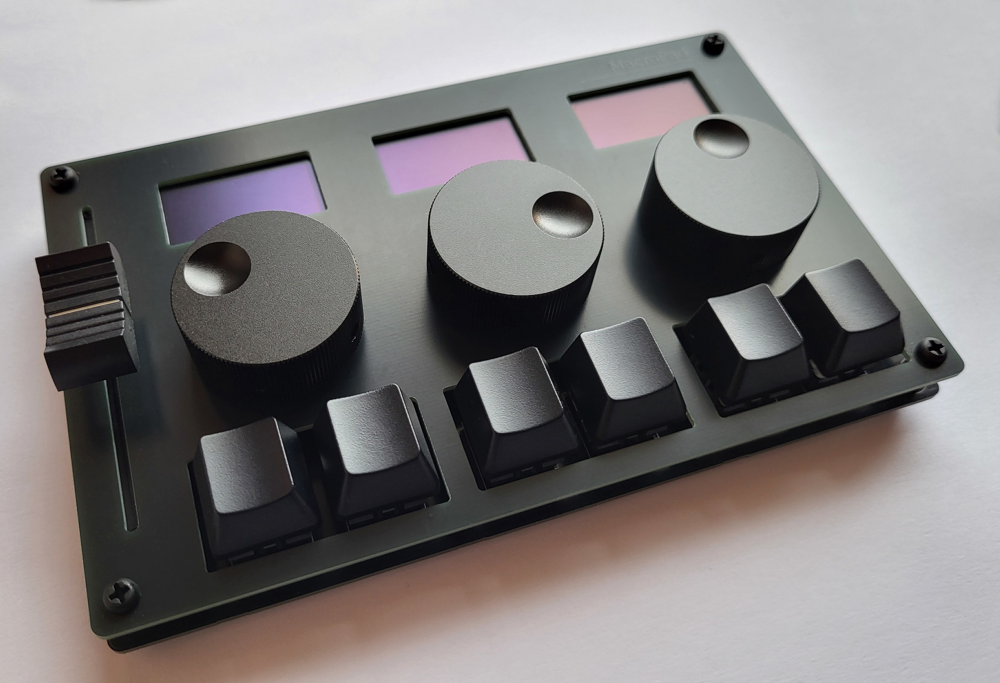

# MacroPad

> [!NOTE]
> This project is still under development. While almost everything works on Linux, Windows is a mess.

## What is This?
MacroPad is a USB input device with six keys, three rotary encoders, a slider,
and three OLED displays. All controls can be configured to send user-defined
mouse or keyboard input to the computer. Multiple profiles are supported,
allowing you to change between different key-assignments with the press of a
button. Typical applications include audio and video editing, computer graphics,
and presentations.

MacroPad implements standard USB HID (human interface) device classes and thus
requires no driver. The only is software that is needed is a [Program for
Configuring](Software/) it and potentially some [software for the slider](SliderApps/).

MacroPad is powered by a
[Raspberry Pi Pico](https://www.raspberrypi.com/documentation/microcontrollers/raspberry-pi-pico.html)
using the RP2040 microcontroller.

## How Does It Work?
When plugged into a computer, MacroPad presents itself as a three-in-one
input device composed of a keyboard, a mouse, and a miscellaneous input device.
All keys and rotary encoders can be configured to send keyboard or mouse input
to the computer.

The slider is also an HID-class device that needs no driver. However, most
operating systems don't know what to do with slider input and so they just
ignore it. For that reason, you will most likely want to have a piece of
software running that consumes these inputs and performs certain actions,
like adjusting volume or changing the brush size in a drawing application. 
You can find several examples in the [SliderApps](SliderApps/) folder.

## Can I Have One?
MacroPad is not sold anywhere. In this repository, you can find all the
necessary information and code to build a MacroPad yourself. Please have a look
at the [Building Instructions](Documentation/BuildingInstructions.pdf) and
the [User's Guide](Documentation/UsersGuide.pdf).
Building a MacroPad is not particularly difficult. As long as you can hold a
soldering iron without touching the wrong end, you should be fine.
